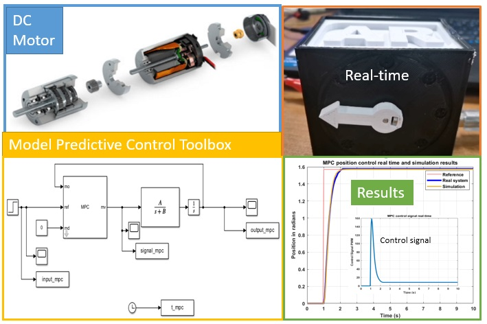

# Intelligent Control Systems  by Asst. Prof. Dr. Claudia F. Yaşar

This repository contains the curriculum materials used for the Intelligent Control Systems course YTU Department of Control and Automation Engineering.
# Model-Predictive-Control-DC-motor
This live swork delves into Model Predictive Control (MPC) using Simulink, highlighting its accuracy and adaptability. It offers a practical framework for real-world MPC applications. Featuring a hands-on demonstration with a live DC motor setup, it showcases MPC's experimental response and its broad applicability in control systems.

# Acknowledgements
I would like to express my gratitude to the students of the Intelligent Control Systems course of the YTÜ Control and Automation Engineering department, Class 2022 and 2023, whose dedication and hard work made this project possible. I am also deeply thankful to our Control Tech LAB team, Doctors Marco Rossi and Melda Ulusoy for their invaluable contributions.

